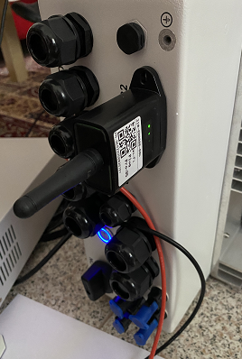

The code is in continuous development, can be used both on the RS232 port and on the RS485 modbus port with the help of a modbus adapter

Code can be used with ESP8266, ESP32 or dongle with EB-WF03-01

Setup code is set for dongle (communication ports and leds)

const int PIN_LED = 2; // D4 on NodeMCU and WeMos. GPIO2/ADC12 of ESP32. Controls the onboard LED.

Settings leds for dongle: 

const int PIN_LED = 5;  // COM

const int PIN_LED2 = 0; // SRV

const int PIN_LED4 = 4; // NET

